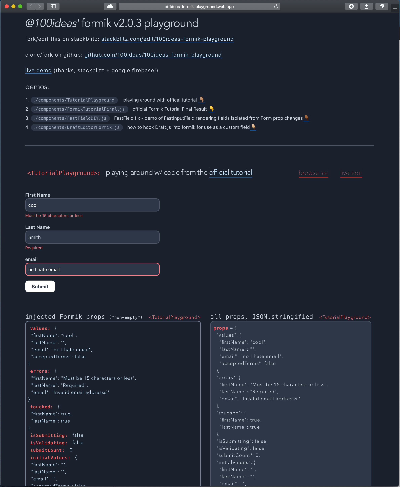

# 100ideas-formik-playground
*for formik v2.0.3*

[`this is just a little mini react app`](https://ideas-formik-playground.web.app) I smooshed together to help myself learn formik@v2.0.3's api. Its just a simple single-serving site with 4 examples sourced from preexisting tutorials / docs / issues.

#### do this!
- [Play with the live demo app](https://ideas-formik-playground.web.app) (thanks, stackblitz + google firebase!)
- [Edit on StackBlitz ⚡️](https://stackblitz.com/edit/100ideas-formik-playground)
- [Fork the repo on github](https://github.com/100ideas/100ideas-formik-playground)
- then add some more demos and send over a PR! 👍🏻
- read the `formik` docs: https://jaredpalmer.com/formik/
- discuss: 
  - [dev.to](https://dev.to/100ideas/formik-v2-0-3-demo-playground-stackblitz-web-ide-5ep9) 
  - [formik repo](https://github.com/jaredpalmer/formik) ~~~issue tracker #xx~~~ - not yet

#### demos

- [`./components/TutorialPlayground`](./components/TutorialPlayground`): playing around with offical tutorial

- [`./components/FormikTutorialFinal.js`](./components/FormikTutorialFinal.js): official Formik Tutorial Final Result

- [`./components/FastFieldDIY.js`](./components/FastFieldDIY.js): FastField fix - demo of FastInputField rendering fields isolated from Form prop changes

- [`./components/DraftEditorFormik.js`](./components/DraftEditorFormik.js): how to hook Draft.js into formik for use as a custom field

#### thanks

Thanks to @jaredpalmer for the snappy css boilerplate (from formik-v2 codesandbox), it's sharp! Furthermore, *thank you* for creating formik & documenting it well.

also "thank you" to [@ersel for demonstrating how to recreate the functionality of `<FastField>`](https://github.com/jaredpalmer/formik/issues/1739#issuecomment-521175764) in \^v2.0.3 

thanks, stackblitz, for the free, snappy (ususally) browser IDE

thanks to google for the free hosting on google firebase

and thank you *reader* for playing around!

